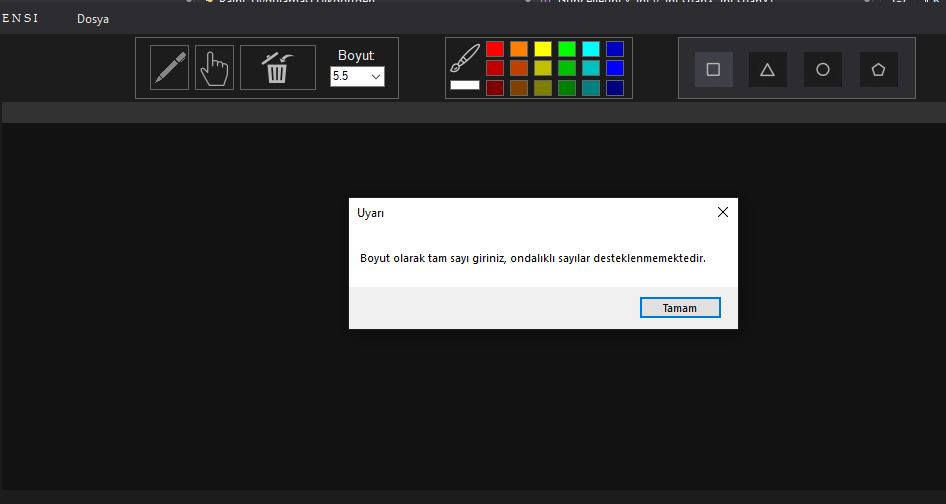

# Paint_Uygulamasi
> * _Microsoft Visual Studio Communtiy 2019
 Sürüm 16.1.1_ ortamında
 C# kullanılarak yapılmıştır.
> * Uygulamanın her aşaması 'commit' edilmiştir.
> * Bitirme Tarihi: 14.07.2019
> * Yazar: Enes Sirkecioğlu
> * Mail: enes.sirkecoglu@ogr.sakarya.edu.tr

## Uygulama Görünümü ve Kullanılanlar
 

* Renk panelinde 'PictureBox' öğeleri kullanılmıştır. Her öğenin arkaplanı temsil ettiği renge göre seçilmiştir.
* İkonlar internet üzerinden bulunup 'Paint.net' programıyla aynı renk tonu ve boyuta getirilmiştir.
* Dosya işlemleri için 'menuStrip' öğesi kullanılmıştır.
* Boyut seçimi için 'comboBox' öğesi kullanılmıştır.

## Sınıflar ve Kullanım Amaçları

#### 'Islemler' Sınıfı
* Sınıf içerisinde 'void' türünden iki fonksiyon vardır.
* **Dosya Yaz:** Bu fonksiyonda 'SaveFileDialog' kullanılmıştır ve eğer kullanıcı dosya uzantısı belirtmezse varsayılan olarak '.txt' uzantısı ayarlanmıştır. 
* Uygulamada çizilen şekiller bir listede tutulmaktadır. Dosya yazma işleminde bu liste kullanılarak her dosyanın gerekli koordinatları, şekil isimleri, çizildiği kalemin rengi ve boyutunun bilgileri yazılmaktadır. Bu işlemler 'try-catch' bloğu içerisine alınmıştır, dosya açma sırasında oluşan hatalarda uyarı mesajı verilmektedir.
* Renk bilgileri rgb değerlerine göre dosyaya yazılmaktadır.
* **Dosya Oku:** Bu fonksiyonda 'OpenFileDialog' kullanılmıştır ve okuma işlemini 'txt' dosyalarında yapacağımız için ona göre filtreleme yapılmıştır.
* Okunacak 'txt' dosyasında şekillerin bilgileri bulunmaktadır.

* Dosya okuma işlemi başlarken öncelikle şekillerin tutuldu liste temizlenir. Yeni okunan değerlere göre şekiller kendi cizme fonksiyonları ile yeniden çizilir ve listeye eklenir.

#### 'Sekiller' Sınıfı
* Bu sınıf içerisinde şekillerin genel olarak ortak özelliklerini barındırmaktadır.
* Diğer sınıflar 'Sekiller' sınıfından kalıtım alacaklardır.
* Her sınıfta bulunan 'Ciz' fonksiyona erişim için bu fonksiyonda **virtual** olarak tanımlanmıştır.

#### Genel Olarak 'Sekiller' İçerisindeki Sınıfların Özellikleri
* Yapıcı fonksiyonunda başlangıç koordinatları, oluşturulan şeklin ismi ve kalem nesnesi tanımlanmaktadır.
* Çizme işlemi yapılırken 'Guncelle' fonksiyonunda  hangi yöne doğru çizildiği karar yapılarıyla kontrol edilerek gerekli hesaplamalar yapılmıştır.
* Çizme işlemi 'Sekiller' sınıfı nesnesi üzerinden çağrılabilmesi için fonksiyon **override** olarak tanımlanmıştır.

#### Programın Farklı Girdilere Karşı Davranışları
* Boyut seçilirken eğer ondalıklı bir sayı girilirse uyarı mesajı gösterilmektedir. Ondalıklı sayı girildiğinde 'comboBox'tan alınan değer 'string' değerinden 'int' türüne dönüştürüldüğü için hata ile karşılaşılmaktadır.

#### Yapım Aşamasında Karşılaşılan Zorluklar
* Şekil çizmenin yanı sıra kalem ile serbest çizme eklenmişti fakat bu çizme işleminde çok fazla 'Point' nesnesi oluştuğundan dolayı performans kaybı oluşmuştu. Bu sebepten dolayı serbest çizme işlemi yerine doğru çizimi eklenmiştir.
* ikonların bulunduğu Resources dosyasından bazı işe yaramayan resimleri silince form uygulamasında hata alındı. Bu hata Resources.resx dosyasında tanımlanan resimleri manuel olarak silince çözülmüştür.
* Şekil seçim işleminde eğer şekil düz bir çizgi olarak çizilmişse seçme işlemi hatalı çizmekteydi. Bu sorun matematiksel hesaplamalar ile çözülmüştür.
